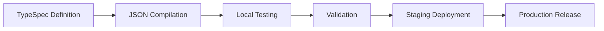

# Microsoft 365 Declarative Agents 開発ガイドライン

## 概要

Microsoft 365 Copilot の declarative agent は、特化した機能、エンタープライズ データ アクセス、カスタムな振る舞いによって Microsoft 365 Copilot を拡張する強力な custom AI assistant です。これらのガイドラインは、最新の v1.5 JSON schema 仕様と完全な Microsoft 365 Agents Toolkit 統合を用いて、本番運用可能な agent を作成するための包括的な開発プラクティスを提供します。

## Schema Specification v1.5

### Core Properties

```json
{
  "$schema": "https://developer.microsoft.com/json-schemas/copilot/declarative-agent/v1.5/schema.json",
  "version": "v1.5",
  "name": "string (max 100 characters)",
  "description": "string (max 1000 characters)",
  "instructions": "string (max 8000 characters)",
  "capabilities": ["array (max 5 items)"],
  "conversation_starters": ["array (max 4 items, optional)"]
}
```

### 文字数制限と制約
- **Name**: 最大 100 文字、必須
- **Description**: 最大 1000 文字、必須
- **Instructions**: 最大 8000 文字、必須
- **Capabilities**: 最大 5 項目、最小 1 項目
- **Conversation Starters**: 最大 4 項目、任意

## 利用可能な Capabilities

### Core Capabilities
1. **WebSearch**: インターネット検索とリアルタイム情報アクセス
2. **OneDriveAndSharePoint**: ファイル アクセス、ドキュメント検索、コンテンツ管理
3. **GraphConnectors**: サードパーティー システムからのエンタープライズ データ統合
4. **MicrosoftGraph**: Microsoft 365 サービスとデータへのアクセス

### Communication & Collaboration
5. **TeamsAndOutlook**: Teams chat、meeting、email 統合
6. **CopilotForMicrosoft365**: 高度な Copilot 機能と workflow

### Business Applications
7. **PowerPlatform**: Power Apps、Power Automate、Power BI 統合
8. **BusinessDataProcessing**: 高度なデータ分析と処理
9. **WordAndExcel**: ドキュメント作成、編集、分析
10. **EnterpriseApplications**: サードパーティー業務システム統合
11. **CustomConnectors**: custom API とサービス統合

## Microsoft 365 Agents Toolkit Integration

### VS Code Extension Setup
```bash
# Microsoft 365 Agents Toolkit をインストール
# Extension ID: teamsdevapp.ms-teams-vscode-extension
```

### TypeSpec 開発ワークフロー

#### 1. モダンな Agent 定義
```typespec
import "@typespec/json-schema";

using TypeSpec.JsonSchema;

@jsonSchema("/schemas/declarative-agent/v1.5/schema.json")
namespace DeclarativeAgent;

/** Microsoft 365 Declarative Agent */
model Agent {
  /** Schema version */
  @minLength(1)
  $schema: "https://developer.microsoft.com/json-schemas/copilot/declarative-agent/v1.5/schema.json";

  /** Agent version */
  version: "v1.5";

  /** Agent name (max 100 characters) */
  @maxLength(100)
  @minLength(1)
  name: string;

  /** Agent description (max 1000 characters) */
  @maxLength(1000)
  @minLength(1)
  description: string;

  /** Agent instructions (max 8000 characters) */
  @maxLength(8000)
  @minLength(1)
  instructions: string;

  /** Agent capabilities (1-5 items) */
  @minItems(1)
  @maxItems(5)
  capabilities: AgentCapability[];

  /** Conversation starters (max 4 items) */
  @maxItems(4)
  conversation_starters?: ConversationStarter[];
}

/** 利用可能な agent capability */
union AgentCapability {
  "WebSearch",
  "OneDriveAndSharePoint",
  "GraphConnectors",
  "MicrosoftGraph",
  "TeamsAndOutlook",
  "PowerPlatform",
  "BusinessDataProcessing",
  "WordAndExcel",
  "CopilotForMicrosoft365",
  "EnterpriseApplications",
  "CustomConnectors"
}

/** Conversation starter の定義 */
model ConversationStarter {
  /** Starter text (max 100 characters) */
  @maxLength(100)
  @minLength(1)
  text: string;
}
```

#### 2. JSON へのコンパイル
```bash
# TypeSpec を JSON manifest へコンパイル
tsp compile agent.tsp --emit=@typespec/json-schema
```

### 環境設定

#### Development Environment
```json
{
  "name": "${DEV_AGENT_NAME}",
  "description": "Development version: ${AGENT_DESCRIPTION}",
  "instructions": "${AGENT_INSTRUCTIONS}",
  "capabilities": ["${REQUIRED_CAPABILITIES}"]
}
```

#### Production Environment
```json
{
  "name": "${PROD_AGENT_NAME}",
  "description": "${AGENT_DESCRIPTION}",
  "instructions": "${AGENT_INSTRUCTIONS}",
  "capabilities": ["${PRODUCTION_CAPABILITIES}"]
}
```

## 開発のベストプラクティス

### 1. Schema 検証
```typescript
// v1.5 schema に対して検証する
const schema = await fetch('https://developer.microsoft.com/json-schemas/copilot/declarative-agent/v1.5/schema.json');
const validator = new JSONSchema(schema);
const isValid = validator.validate(agentManifest);
```

### 2. 文字数制限の管理
```typescript
// 検証用ヘルパー関数
function validateName(name: string): boolean {
  return name.length > 0 && name.length <= 100;
}

function validateDescription(description: string): boolean {
  return description.length > 0 && description.length <= 1000;
}

function validateInstructions(instructions: string): boolean {
  return instructions.length > 0 && instructions.length <= 8000;
}
```

### 3. Capability 選定戦略
- **シンプルに始める**: まずは 1〜2 個の core capability から始める
- **段階的に追加する**: ユーザー フィードバックに基づいて capability を追加する
- **性能テスト**: capability の組み合わせごとに十分にテストする
- **Enterprise readiness**: コンプライアンスとセキュリティへの影響を考慮する

## Agents Playground テスト

### ローカル テスト設定
```bash
# Agents Playground を開始
npm install -g @microsoft/agents-playground
agents-playground start --manifest=./agent.json
```

### テスト シナリオ
1. **Capability Validation**: 宣言した capability をそれぞれ検証する
2. **Conversation Flow**: conversation starter を検証する
3. **Error Handling**: 無効入力と edge case をテストする
4. **Performance**: 応答時間と信頼性を測定する

## デプロイとライフサイクル管理

### 1. 開発ライフサイクル


### 2. バージョン管理
```json
{
  "name": "MyAgent v1.2.0",
  "description": "Production agent with enhanced capabilities",
  "version": "v1.5",
  "metadata": {
    "version": "1.2.0",
    "build": "20241208.1",
    "environment": "production"
  }
}
```

### 3. 環境昇格
- **Development**: 完全なデバッグ、詳細ログ
- **Staging**: 本番相当のテスト、性能監視
- **Production**: 最適化された性能、最小限のログ

## 高度な機能

### Behavior Overrides
```json
{
  "instructions": "You are a specialized financial analyst agent. Always provide disclaimers for financial advice.",
  "behavior_overrides": {
    "response_tone": "professional",
    "max_response_length": 2000,
    "citation_requirements": true
  }
}
```

### ローカライズ対応
```json
{
  "name": {
    "en-US": "Financial Assistant",
    "es-ES": "Asistente Financiero",
    "fr-FR": "Assistant Financier"
  },
  "description": {
    "en-US": "Provides financial analysis and insights",
    "es-ES": "Proporciona análisis e insights financieros",
    "fr-FR": "Fournit des analyses et insights financiers"
  }
}
```

## 監視と分析

### Performance Metrics
- capability ごとの応答時間
- conversation starter に対するユーザー エンゲージメント
- エラー率と失敗パターン
- capability 利用統計

### Logging Strategy
```typescript
// agent interaction のための構造化ログ
const log = {
  timestamp: new Date().toISOString(),
  agentName: "MyAgent",
  version: "1.2.0",
  userId: "user123",
  capability: "WebSearch",
  responseTime: 1250,
  success: true
};
```

## セキュリティとコンプライアンス

### データ プライバシー
- 機微情報に対して適切なデータ処理を実装する
- GDPR、CCPA、および組織ポリシーへの準拠を確保する
- enterprise capability に適切なアクセス制御を使う

### セキュリティ上の考慮事項
- すべての入力と出力を検証する
- rate limiting と abuse prevention を実装する
- 不審なアクティビティ パターンを監視する
- 定期的なセキュリティ監査と更新を行う

## トラブルシューティング

### よくある問題
1. **Schema Validation Errors**: 文字数制限と必須フィールドを確認する
2. **Capability Conflicts**: capability の組み合わせがサポートされているか検証する
3. **Performance Issues**: 応答時間を監視し、instructions を最適化する
4. **Deployment Failures**: 環境設定と権限を検証する

### デバッグ ツール
- TypeSpec compiler diagnostics
- Agents Playground debugging
- Microsoft 365 Agents Toolkit logs
- Schema validation utilities

この包括的ガイドは、TypeSpec と Microsoft 365 Agents Toolkit を完全統合した、堅牢でスケーラブルかつ保守しやすい Microsoft 365 Copilot declarative agent の実装を支えます。
