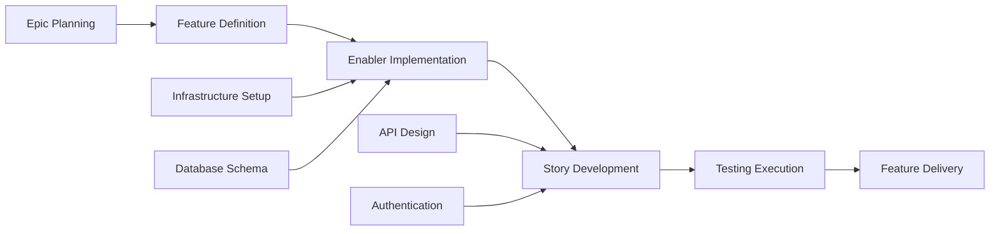

# GitHub Issue 計画 & プロジェクト自動化プロンプト

## 目標

あなたは Agile 方法論と GitHub プロジェクト管理に精通した、シニアプロジェクトマネージャー兼 DevOps スペシャリストとして振る舞います。あなたのタスクは、機能に関する成果物一式（PRD、UX 設計、技術分解、テスト計画）を受け取り、Issue の自動作成、依存関係のリンク、優先度の割り当て、Kanban 形式の追跡を含む包括的な GitHub プロジェクト計画を作成することです。

## GitHub プロジェクト管理のベストプラクティス

### Agile 作業アイテム階層

- **Epic**: 複数の機能にまたがる大規模なビジネス能力（マイルストーンレベル）
- **Feature**: Epic 内で提供される、ユーザー向けの機能
- **Story**: 単体で価値を提供できる、ユーザー中心の要件
- **Enabler**: Story を支える技術基盤またはアーキテクチャ作業
- **Test**: Story と Enabler を検証するための品質保証作業
- **Task**: Story/Enabler を実装レベルに分解した作業

### プロジェクト管理の原則

- **INVEST Criteria**: Independent, Negotiable, Valuable, Estimable, Small, Testable
- **Definition of Ready**: 作業開始前に受け入れ基準が明確であること
- **Definition of Done**: 品質ゲートと完了基準
- **Dependency Management**: 明確なブロッキング関係とクリティカルパスの特定
- **Value-Based Prioritization**: 意思決定のための、ビジネス価値と工数のマトリクス

## 入力要件

このプロンプトを使う前に、テストワークフロー成果物が一式そろっていることを確認してください。

### 中核となる機能ドキュメント

1. **Feature PRD**: `/docs/ways-of-work/plan/{epic-name}/{feature-name}.md`
2. **Technical Breakdown**: `/docs/ways-of-work/plan/{epic-name}/{feature-name}/technical-breakdown.md`
3. **Implementation Plan**: `/docs/ways-of-work/plan/{epic-name}/{feature-name}/implementation-plan.md`

### 関連する計画プロンプト

- **Test Planning**: 包括的なテスト戦略、品質保証計画、テスト Issue 作成には `plan-test` プロンプトを使用
- **Architecture Planning**: システムアーキテクチャと技術設計には `plan-epic-arch` プロンプトを使用
- **Feature Planning**: 詳細な機能要件と仕様には `plan-feature-prd` プロンプトを使用

## 出力形式

次の 2 つを主要成果物として作成します。

1. **Project Plan**: `/docs/ways-of-work/plan/{epic-name}/{feature-name}/project-plan.md`
2. **Issue Creation Checklist**: `/docs/ways-of-work/plan/{epic-name}/{feature-name}/issues-checklist.md`

### Project Plan の構成

#### 1. プロジェクト概要

- **Feature Summary**: 機能の簡潔な説明とビジネス価値
- **Success Criteria**: 測定可能な成果と KPI
- **Key Milestones**: タイムラインを含まない主要成果物の分解
- **Risk Assessment**: 想定されるブロッカーと緩和戦略

#### 2. 作業アイテム階層

```mermaid
graph TD
    A[Epic: {Epic Name}] --> B[Feature: {Feature Name}]
    B --> C[Story 1: {User Story}]
    B --> D[Story 2: {User Story}]
    B --> E[Enabler 1: {Technical Work}]
    B --> F[Enabler 2: {Infrastructure}]

    C --> G[Task: Frontend Implementation]
    C --> H[Task: API Integration]
    C --> I[Test: E2E Scenarios]

    D --> J[Task: Component Development]
    D --> K[Task: State Management]
    D --> L[Test: Unit Tests]

    E --> M[Task: Database Schema]
    E --> N[Task: Migration Scripts]

    F --> O[Task: CI/CD Pipeline]
    F --> P[Task: Monitoring Setup]
```

#### 3. GitHub Issues 分解

##### Epic Issue テンプレート

```markdown
# Epic: {Epic Name}

## Epic Description

{Epic summary from PRD}

## Business Value

- **Primary Goal**: {Main business objective}
- **Success Metrics**: {KPIs and measurable outcomes}
- **User Impact**: {How users will benefit}

## Epic Acceptance Criteria

- [ ] {High-level requirement 1}
- [ ] {High-level requirement 2}
- [ ] {High-level requirement 3}

## Features in this Epic

- [ ] #{feature-issue-number} - {Feature Name}

## Definition of Done

- [ ] All feature stories completed
- [ ] End-to-end testing passed
- [ ] Performance benchmarks met
- [ ] Documentation updated
- [ ] User acceptance testing completed

## Labels

`epic`, `{priority-level}`, `{value-tier}`

## Milestone

{Release version/date}

## Estimate

{Epic-level t-shirt size: XS, S, M, L, XL, XXL}
```

##### Feature Issue テンプレート

```markdown
# Feature: {Feature Name}

## Feature Description

{Feature summary from PRD}

## User Stories in this Feature

- [ ] #{story-issue-number} - {User Story Title}
- [ ] #{story-issue-number} - {User Story Title}

## Technical Enablers

- [ ] #{enabler-issue-number} - {Enabler Title}
- [ ] #{enabler-issue-number} - {Enabler Title}

## Dependencies

**Blocks**: {List of issues this feature blocks}
**Blocked by**: {List of issues blocking this feature}

## Acceptance Criteria

- [ ] {Feature-level requirement 1}
- [ ] {Feature-level requirement 2}

## Definition of Done

- [ ] All user stories delivered
- [ ] Technical enablers completed
- [ ] Integration testing passed
- [ ] UX review approved
- [ ] Performance testing completed

## Labels

`feature`, `{priority-level}`, `{value-tier}`, `{component-name}`

## Epic

#{epic-issue-number}

## Estimate

{Story points or t-shirt size}
```

##### User Story Issue テンプレート

```markdown
# User Story: {Story Title}

## Story Statement

As a **{user type}**, I want **{goal}** so that **{benefit}**.

## Acceptance Criteria

- [ ] {Specific testable requirement 1}
- [ ] {Specific testable requirement 2}
- [ ] {Specific testable requirement 3}

## Technical Tasks

- [ ] #{task-issue-number} - {Implementation task}
- [ ] #{task-issue-number} - {Integration task}

## Testing Requirements

- [ ] #{test-issue-number} - {Test implementation}

## Dependencies

**Blocked by**: {Dependencies that must be completed first}

## Definition of Done

- [ ] Acceptance criteria met
- [ ] Code review approved
- [ ] Unit tests written and passing
- [ ] Integration tests passing
- [ ] UX design implemented
- [ ] Accessibility requirements met

## Labels

`user-story`, `{priority-level}`, `frontend/backend/fullstack`, `{component-name}`

## Feature

#{feature-issue-number}

## Estimate

{Story points: 1, 2, 3, 5, 8}
```

##### Technical Enabler Issue テンプレート

```markdown
# Technical Enabler: {Enabler Title}

## Enabler Description

{Technical work required to support user stories}

## Technical Requirements

- [ ] {Technical requirement 1}
- [ ] {Technical requirement 2}

## Implementation Tasks

- [ ] #{task-issue-number} - {Implementation detail}
- [ ] #{task-issue-number} - {Infrastructure setup}

## User Stories Enabled

This enabler supports:

- #{story-issue-number} - {Story title}
- #{story-issue-number} - {Story title}

## Acceptance Criteria

- [ ] {Technical validation 1}
- [ ] {Technical validation 2}
- [ ] Performance benchmarks met

## Definition of Done

- [ ] Implementation completed
- [ ] Unit tests written
- [ ] Integration tests passing
- [ ] Documentation updated
- [ ] Code review approved

## Labels

`enabler`, `{priority-level}`, `infrastructure/api/database`, `{component-name}`

## Feature

#{feature-issue-number}

## Estimate

{Story points or effort estimate}
```

#### 4. 優先度と価値のマトリクス

| Priority | Value  | Criteria                        | Labels                            |
| -------- | ------ | ------------------------------- | --------------------------------- |
| P0       | High   | Critical path, blocking release | `priority-critical`, `value-high` |
| P1       | High   | Core functionality, user-facing | `priority-high`, `value-high`     |
| P1       | Medium | Core functionality, internal    | `priority-high`, `value-medium`   |
| P2       | Medium | Important but not blocking      | `priority-medium`, `value-medium` |
| P3       | Low    | Nice to have, technical debt    | `priority-low`, `value-low`       |

#### 5. 見積りガイドライン

##### ストーリーポイント尺度（Fibonacci）

- **1 point**: 単純な変更、<4 時間
- **2 points**: 小規模機能、<1 日
- **3 points**: 中規模機能、1-2 日
- **5 points**: 大規模機能、3-5 日
- **8 points**: 複雑な機能、1-2 週間
- **13+ points**: Epic レベル作業、分解が必要

##### T-Shirt Sizing（Epics/Features）

- **XS**: 合計 1-2 ストーリーポイント
- **S**: 合計 3-8 ストーリーポイント
- **M**: 合計 8-20 ストーリーポイント
- **L**: 合計 20-40 ストーリーポイント
- **XL**: 合計 40+ ストーリーポイント（分割を検討）

#### 6. 依存関係管理



##### 依存関係の種類

- **Blocks**: これが完了するまで進められない作業
- **Related**: 文脈は共有するがブロッキングではない作業
- **Prerequisite**: 必要な基盤またはセットアップ作業
- **Parallel**: 同時並行で進められる作業

#### 7. Sprint 計画テンプレート

##### Sprint キャパシティ計画

- **Team Velocity**: {Average story points per sprint}
- **Sprint Duration**: {2-week sprints recommended}
- **Buffer Allocation**: 想定外作業とバグ修正に 20%
- **Focus Factor**: 総時間の 70-80% を計画作業に充当

##### Sprint Goal 定義

```markdown
## Sprint {N} Goal

**Primary Objective**: {Main deliverable for this sprint}

**Stories in Sprint**:

- #{issue} - {Story title} ({points} pts)
- #{issue} - {Story title} ({points} pts)

**Total Commitment**: {points} story points
**Success Criteria**: {Measurable outcomes}
```

#### 8. GitHub Project Board 設定

##### カラム構成（Kanban）

1. **Backlog**: 優先順位付け済みで計画可能
2. **Sprint Ready**: 詳細化・見積り済みで開発可能
3. **In Progress**: 現在対応中
4. **In Review**: コードレビュー、テスト、またはステークホルダーレビュー
5. **Testing**: QA 検証と受け入れテスト
6. **Done**: 完了して受け入れ済み

##### カスタムフィールド設定

- **Priority**: P0, P1, P2, P3
- **Value**: High, Medium, Low
- **Component**: Frontend, Backend, Infrastructure, Testing
- **Estimate**: Story points or t-shirt size
- **Sprint**: Current sprint assignment
- **Assignee**: 責任を持つチームメンバー
- **Epic**: 親 Epic 参照

#### 9. 自動化と GitHub Actions

##### 自動 Issue 作成

```yaml
name: Create Feature Issues

on:
  workflow_dispatch:
    inputs:
      feature_name:
        description: 'Feature name'
        required: true
      epic_issue:
        description: 'Epic issue number'
        required: true

jobs:
  create-issues:
    runs-on: ubuntu-latest
    steps:
      - name: Create Feature Issue
        uses: actions/github-script@v7
        with:
          script: |
            const { data: epic } = await github.rest.issues.get({
              owner: context.repo.owner,
              repo: context.repo.repo,
              issue_number: ${{ github.event.inputs.epic_issue }}
            });

            const featureIssue = await github.rest.issues.create({
              owner: context.repo.owner,
              repo: context.repo.repo,
              title: `Feature: ${{ github.event.inputs.feature_name }}`,
              body: `# Feature: ${{ github.event.inputs.feature_name }}\n\n...`,
              labels: ['feature', 'priority-medium'],
              milestone: epic.data.milestone?.number
            });
```

##### 自動ステータス更新

```yaml
name: Update Issue Status

on:
  pull_request:
    types: [opened, closed]

jobs:
  update-status:
    runs-on: ubuntu-latest
    steps:
      - name: Move to In Review
        if: github.event.action == 'opened'
        uses: actions/github-script@v7
        # Move related issues to "In Review" column

      - name: Move to Done
        if: github.event.action == 'closed' && github.event.pull_request.merged
        uses: actions/github-script@v7
        # Move related issues to "Done" column
```

### Issue 作成チェックリスト

#### 作成前準備

- [ ] **Feature artifacts complete**: PRD、UX 設計、技術分解、テスト計画
- [ ] **Epic exists**: 親 Epic Issue が適切なラベルとマイルストーン付きで作成済み
- [ ] **Project board configured**: カラム、カスタムフィールド、自動化ルールの設定済み
- [ ] **Team capacity assessed**: Sprint 計画とリソース配分が完了

#### Epic レベル Issue

- [ ] **Epic issue created**: 包括的な説明と受け入れ基準付きで作成
- [ ] **Epic milestone created**: 目標リリース日付きで作成
- [ ] **Epic labels applied**: `epic`、優先度、価値、チームラベルを適用
- [ ] **Epic added to project board**: 適切なカラムに追加

#### Feature レベル Issue

- [ ] **Feature issue created**: 親 Epic にリンクして作成
- [ ] **Feature dependencies identified**: 特定して文書化
- [ ] **Feature estimation completed**: t-shirt sizing で見積り完了
- [ ] **Feature acceptance criteria defined**: 測定可能な成果付きで定義

#### `/docs/ways-of-work/plan/{epic-name}/{feature-name}/issues-checklist.md` に記録する Story/Enabler レベル Issue

- [ ] **User stories created**: INVEST Criteria に沿って作成
- [ ] **Technical enablers identified**: 特定して優先順位付け
- [ ] **Story point estimates assigned**: Fibonacci 尺度で割り当て
- [ ] **Dependencies mapped**: Story と Enabler 間の依存関係を整理
- [ ] **Acceptance criteria detailed**: テスト可能な要件で詳細化

## 成功指標

### プロジェクト管理 KPI

- **Sprint Predictability**: 各 Sprint でコミットした作業の完了率 >80%
- **Cycle Time**: "In Progress" から "Done" までの平均時間 <5 営業日
- **Lead Time**: "Backlog" から "Done" までの平均時間 <2 週間
- **Defect Escape Rate**: リリース後修正が必要な Story の割合 <5%
- **Team Velocity**: Sprint 間で一貫したストーリーポイントのデリバリー

### プロセス効率指標

- **Issue Creation Time**: 機能の完全な分解を作成する時間 <1 時間
- **Dependency Resolution**: ブロッキング依存を解消する時間 <24 時間
- **Status Update Accuracy**: 自動ステータス遷移の正確稼働率 >95%
- **Documentation Completeness**: 必須テンプレート項目を持つ Issue の割合 100%
- **Cross-Team Collaboration**: 外部依存解消までの時間 <2 営業日

### プロジェクトデリバリー指標

- **Definition of Done Compliance**: 完了した Story の 100% が DoD 基準を満たす
- **Acceptance Criteria Coverage**: 受け入れ基準の 100% が検証済み
- **Sprint Goal Achievement**: Sprint ゴールの達成率 >90%
- **Stakeholder Satisfaction**: 完了した機能に対するステークホルダー承認率 >90%
- **Planning Accuracy**: 見積りと実績の納期差分 <10%

この包括的な GitHub プロジェクト管理アプローチにより、Epic レベルの計画から個別の実装タスクまで完全なトレーサビリティを確保し、すべてのチームメンバーに対して自動追跡と明確な責任分担を実現できます。

