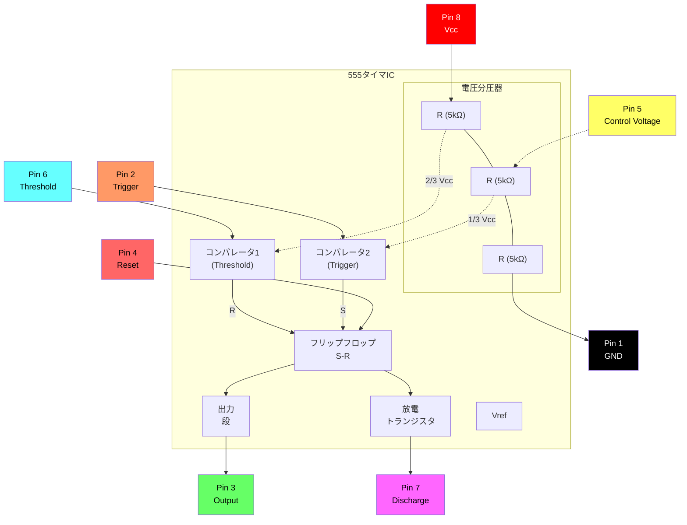
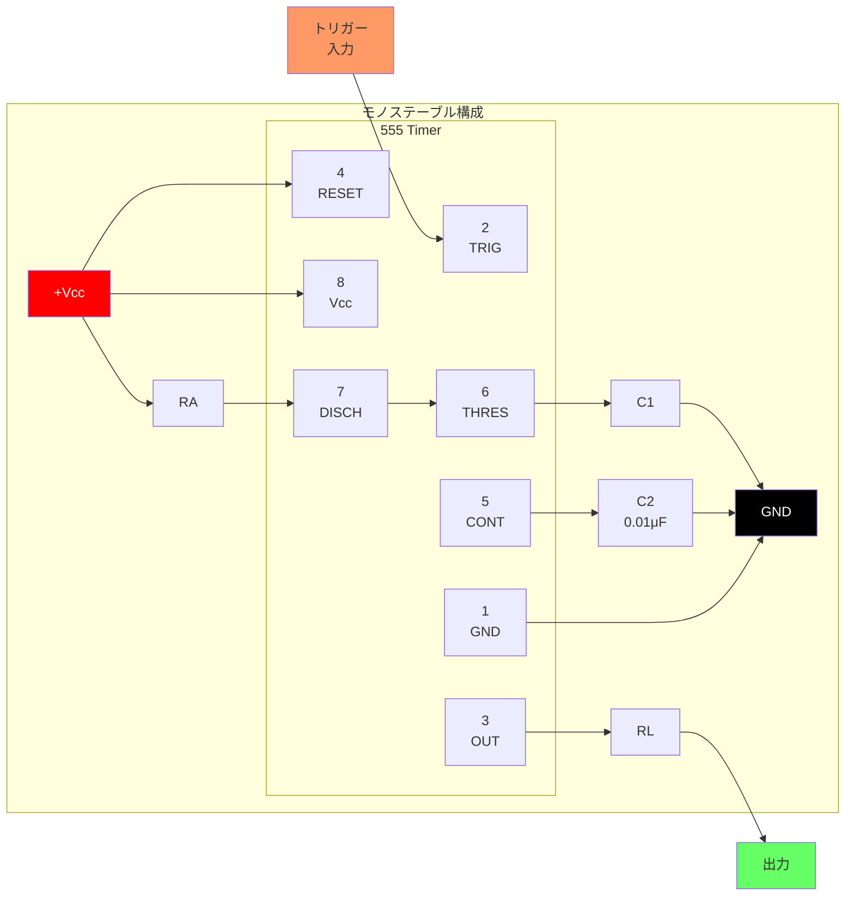
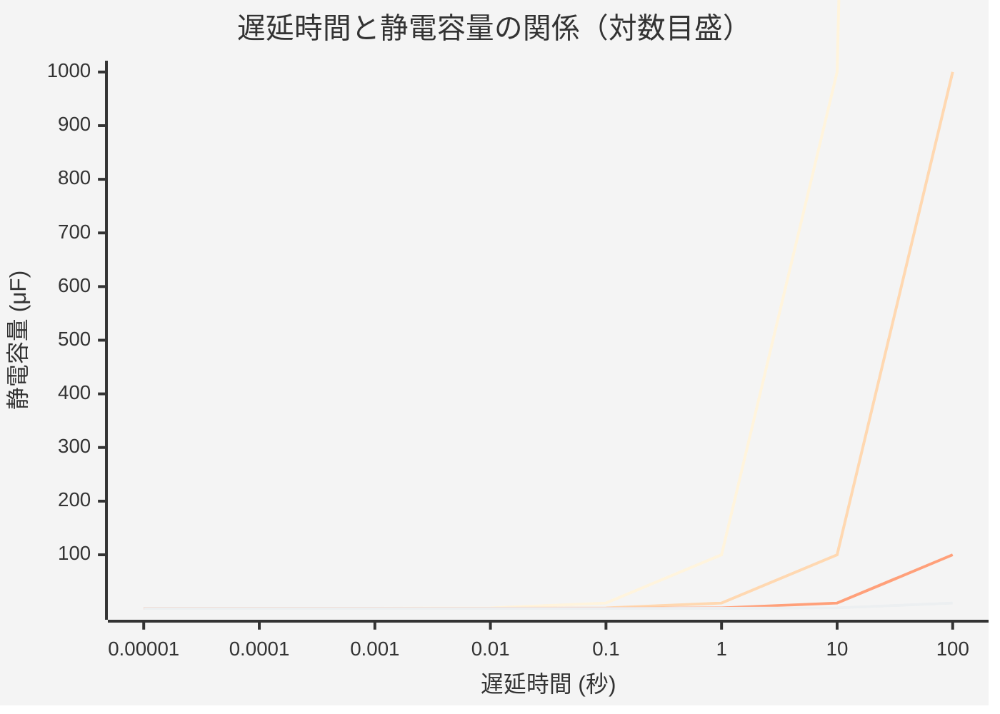
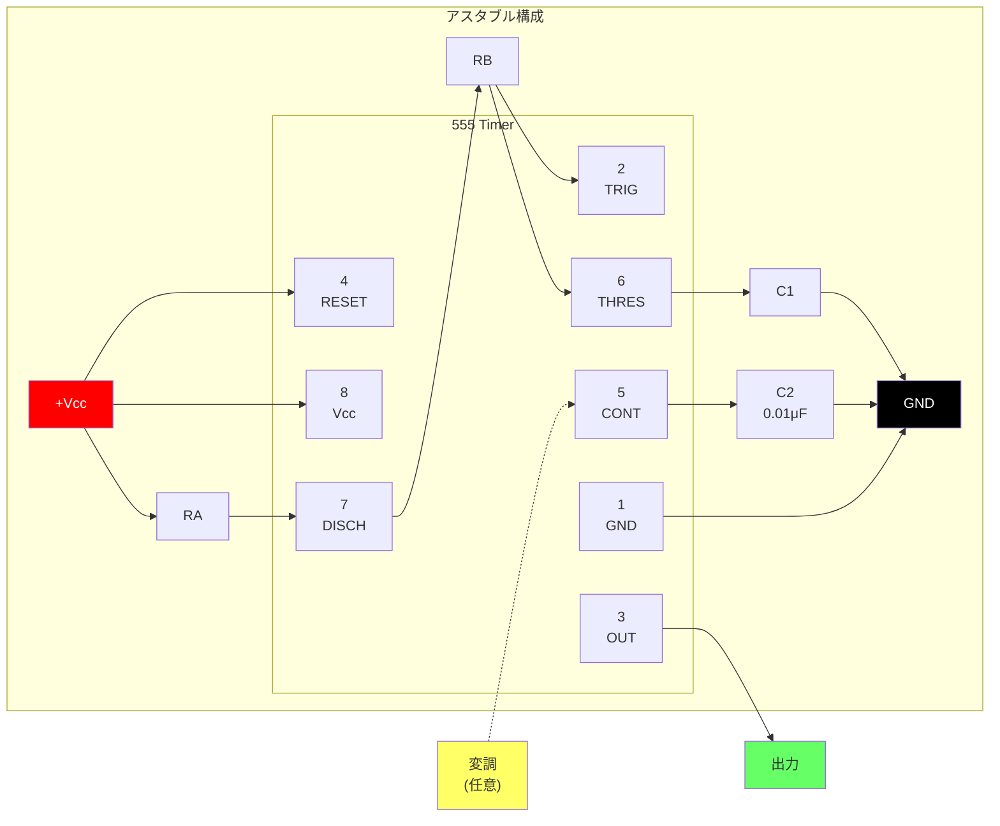
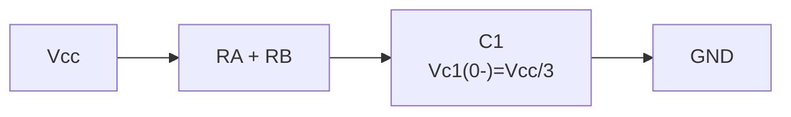
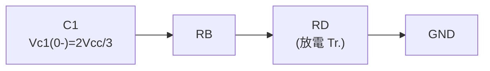
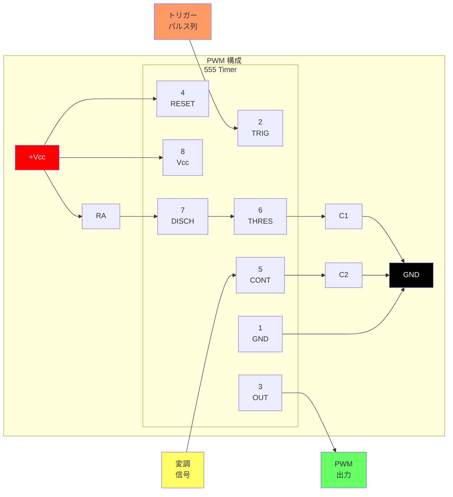
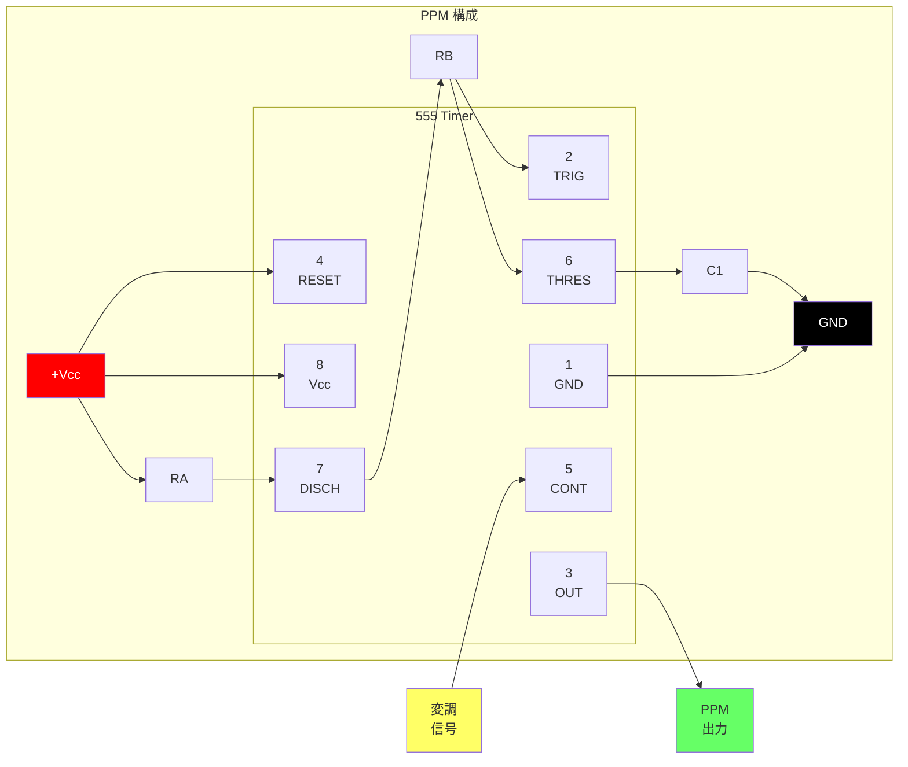
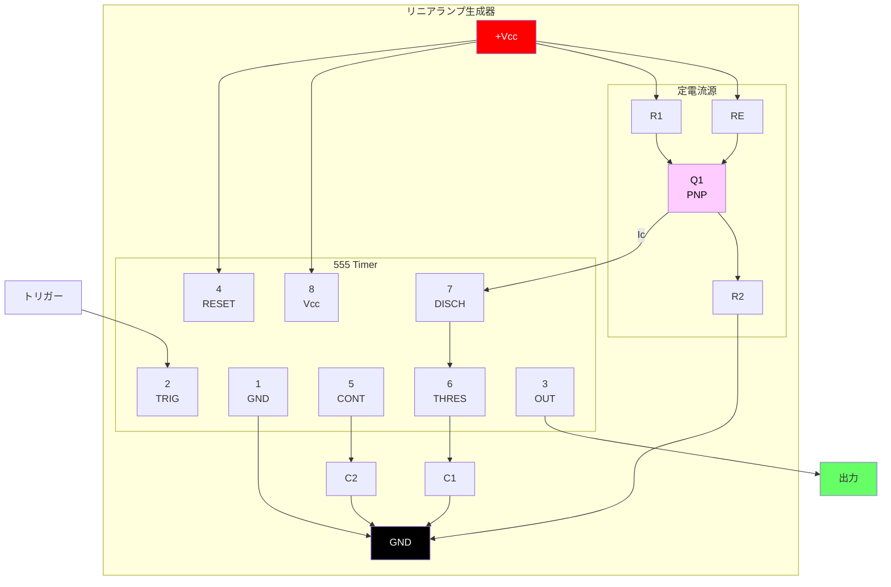

# 555

[www.fairchildsemi.com](www.fairchildsemi.com)

LM555/NE555/SA555 は、高精度のタイミングパルスを生成できる高安定コントローラーです。モノステーブル動作では、時間遅延は外付け抵抗1本とコンデンサ1個で制御されます。アスタブル動作では、周波数とデューティサイクルは外付け抵抗2本とコンデンサ1個で正確に制御されます。

## 特長

- 大電流駆動能力（200mA）
- 調整可能なデューティサイクル
- 温度安定性 0.005%/°C
- タイミング範囲は μSec から数時間まで
- ターンオフ時間は 2μSec 未満

## 用途

- 高精度タイミング
- パルス生成
- 遅延時間生成
- シーケンシャルタイミング

## 内部ブロック図



**ピン構成:**

| Pin | Name | Function |
|:---:|:---|:---|
| 1 | GND | グランド基準 |
| 2 | TRIG | トリガー入力（< 1/3 Vcc でタイミング開始） |
| 3 | OUT | 出力（high または low） |
| 4 | RESET | アクティブ low リセット |
| 5 | CONT | 制御電圧（2/3 Vcc 基準） |
| 6 | THRES | しきい値入力（> 2/3 Vcc でタイミング終了） |
| 7 | DISCH | 放電（オープンコレクタ） |
| 8 | Vcc | 電源電圧（+4.5V ～ +16V） |

## 絶対最大定格 (Ta = 25°C)

| パラメータ | 記号 | 値 | 単位 |
| :--- | :--- | :--- | :--- |
| 電源電圧 | Vcc | 16 | V |
| リード温度（はんだ付け 10 秒） | Tled | 300 | °C |
| 消費電力 | PD | 600 | mW |
| 動作温度範囲<br>LM555/NE555<br>SA555 | Topr | - 65 ~ + 150 | °C |

## 電気的特性

(TA = 25°C、Vcc = 5 ~ 15V、特に指定のない限り)

| パラメータ | 記号 | 条件 | Min. | Typ. | Max. | 単位 |
| :--- | :--- | :--- | :--- |:--- | :--- | :--- |
| 電源電圧 | Vcc | - | 4.5 | - | 16 | V |
| 電源電流（Low Stable）（注1） | Icc | Vcc = 5V, Rl = ∞<hr>Vcc = 15V, Rl = ∞ | -<hr>- | 3<hr>7.5 | 6<hr>15 | mA<hr>mA |
| タイミング誤差（モノステーブル）<br>初期精度（注2）<br>温度ドリフト（注4）<br>電源電圧ドリフト（注4）<br> | ACCUR<br>Δt/ΔT<br>Δt/ΔVcc | Ra = 1kΩ to100kΩ<br>C = 0.1μF | - | 1.0<br>50<br>0.1 | 3.0<br><br>0.5 | %<br>ppm/°C<br>%/V |
| タイミング誤差（アスタブル）<br>初期精度（注2）<br>温度ドリフト（注4）<br>電源電圧ドリフト（注4） | ACCUR<br>Δt/ΔT<br>Δt/ΔVcc | Ra = 1kΩ to 100kΩ<br> C = 0.1μF | - | 2.25<br>150<br>0.3 | - | %<br>ppm/°C<br>%/V |
| 制御電圧 | Vc | Vcc = 15V<hr> Vcc = 5V | 9.0<hr>2.6 | 10.0<hr>3.33 | 11.0<hr>4.0 | V<hr>V |
| しきい値電圧 | VTH | VCC = 15V<hr>VCC = 5V | -<hr>- | 10.0<hr>3.33 | -<hr>- | V<hr>V |
| しきい値電流（注3） | Ith | - | - | 0.1 | 0.25 | μA |
| トリガー電圧 | VTR | VCC = 5V<hr>VCC = 15V | 1.1<hr>4.5 | 1.67<hr>5 | 2.2<hr>5.6 | V<hr>V |
| トリガー電流 | ITR | VTR = 0V | 0.01 | 2.0 | μA |
| リセット電圧 | VRST | - | 0.4 | 0.7 | 1.0 | V |
| リセット電流 | IRST | - | 0.1 | 0.4 | mA |
| 低出力電圧 | VOL | VCC = 15V<br>ISINK = 10mA<br>ISINK = 50mA<hr>VCC = 5V<br>ISINK = 5mA | -<hr>- | 0.06<br>0.3<hr>0.05 | 0.25<br>0.75<hr>0.35 | V<br>V<hr>V |
| 高出力電圧 | VOH | VCC = 15V<br>ISOURCE = 200mA<br>ISOURCE = 100mA<hr>VCC = 5V<br>ISOURCE = 100mA | 12.75<hr>2.75 | 12.5<br>13.3<hr>3.3 | -<hr>- | V<br>V<hr>V |
| 出力立ち上がり時間（注4） | tR | - | - | 100 | - | ns |
| 出力立ち下がり時間（注4） | tF | - | - | 100 | - | ns |
| 放電リーク電流 | ILKG | - | - | 20 | 100 | nA |

**注:**

1. 出力が high のとき、電源電流は通常 VCC = 5V 時より 1mA 少なくなります。
2. VCC = 5.0V および VCC = 15V で試験されています。
3. これにより、15V 動作時の RA + RB の最大値が決まります。総抵抗の最大値は 20MΩ、5V 動作時の最大値は 8.7MΩ です。
4. これらのパラメータは保証されていますが、生産時に 100% 試験されているわけではありません。

## アプリケーション情報

以下の表1は、555 タイマの基本動作表です。

| しきい値電圧<br>(Vth)(PIN 6) | トリガー電圧<br>(Vtr)(PIN 2) | Reset(PIN 4) | Output(PIN 3) | 放電 Tr.<br>(PIN 7) |
| :--- | :--- | :--- | :--- | :--- |
| 不問 | 不問 | Low | Low | ON |
| Vth > 2Vcc / 3 | Vth > 2Vcc / 3 | High | Low | ON |
| Vcc / 3 < Vth < 2 Vcc / 3 | Vcc / 3 < Vth < 2 Vcc / 3 | High | - | - |
| Vth < Vcc / 3 | Vth < Vcc / 3 | High | High | OFF |

low 信号がリセット端子に入力されると、しきい値電圧やトリガー電圧に関係なく、タイマ出力は low のままです。リセット端子に high 信号が入力されたときにだけ、タイマ出力はしきい値電圧とトリガー電圧に応じて変化します。タイマ出力が high の状態で、しきい値電圧が電源電圧の 2/3 を超えると、タイマ内部の放電 Tr. がオンになり、しきい値電圧を電源電圧の 1/3 未満まで下げます。この間、タイマ出力は low に保たれます。その後、トリガー電圧に low 信号が加わって電源電圧の 1/3 になると、タイマ内部の放電 Tr. がオフになり、しきい値電圧が上昇してタイマ出力は再び high になります。

### 1. モノステーブル動作

#### 図1. モノステーブル回路



**部品値:**

- RA: タイミング抵抗（通常 1kΩ ～ 10MΩ）
- C1: タイミングコンデンサ
- C2: バイパスコンデンサ（0.01μF 推奨）
- RL: 負荷抵抗

**遅延時間の式:**
$$t_d = 1.1 \times R_A \times C_1$$

#### 図2. 抵抗値・容量値と遅延時間 (td)



| RA | C1 | 遅延時間 (td) |
|:---|:---|:---|
| 1 kΩ | 0.1 μF | 110 μs |
| 10 kΩ | 0.1 μF | 1.1 ms |
| 100 kΩ | 0.1 μF | 11 ms |
| 1 MΩ | 1 μF | 1.1 s |
| 10 MΩ | 10 μF | 110 s |

#### 図3. モノステーブル動作の波形

```mermaid
%%{init: {'theme': 'base'}}%%
gantt
    title モノステーブル波形（正常動作）
    dateFormat X
    axisFormat %s
    
    section Trigger
    High (Vcc)    :a1, 0, 2
    Low (<Vcc/3)  :crit, a2, 2, 3
    High (Vcc)    :a3, 3, 10
    
    section Output
    Low (0V)      :b1, 0, 2
    High (Vcc)    :active, b2, 2, 8
    Low (0V)      :b3, 8, 10
    
    section Threshold (Vc1)
    Charging      :c1, 2, 8
```



```
    Trigger ─────┐     ┌─────────────────────
    (Pin 2)      └─────┘  
                    ↓ トリガーパルス
                    
    Output  ─────────┐          ┌───────────
    (Pin 3)         └──────────┘
                    |←── td ───→|
                    
    Threshold        /‾‾‾‾‾‾‾‾\
    (Pin 6)    ─────/          \────────────
               0V  ↗            ↘  
                  Vcc/3      2Vcc/3
                  
    td = 1.1 × RA × C1
```

図1はモノステーブル回路を示しています。このモードでは、トリガー電圧が Vcc/3 を下回るたびに、タイマは一定幅のパルスを生成します。タイマ出力が low のときに #2 ピンへ印加されたトリガーパルス電圧が Vcc/3 を下回ると、タイマ内部のフリップフロップによって放電 Tr. がオフになり、同時に外付けコンデンサ C1 が充電されてフリップフロップ出力がセットされるため、タイマ出力は high になります。外付けコンデンサ C1 の両端電圧 VC1 は、時定数 t=RA*C に従って指数関数的に上昇し、td=1.1RA*C で 2Vcc/3 に達します。したがって、コンデンサ C1 は抵抗 RA を通して充電されます。時定数 RAC が大きいほど、VC1 が 2Vcc/3 に達するまでに要する時間は長くなります。言い換えると、時定数 RAC が出力パルス幅を制御します。コンデンサ C1 に加わる電圧が 2Vcc/3 に達すると、トリガー端子側のコンパレータがフリップフロップをリセットし、放電 Tr. をオンにします。このとき C1 は放電を開始し、タイマ出力は low に変化します。このように、モノステーブル動作のタイマは上記のプロセスを繰り返します。図2は RA と C に基づく時定数の関係を示し、図3はモノステーブル動作中の一般的な波形を示しています。正常動作のためには、タイマ出力が low に戻る前に、トリガーパルス電圧が最低でも Vcc/3 を上回る必要がある点に注意してください。つまり、出力が high の間に別のトリガーパルスが印加されても出力自体は影響を受けませんが、出力パルス終了時点でトリガーパルス電圧が Vcc/3 未満のままだと、影響を受けて波形が正常に動作しない可能性があります。図4は、そのようなタイマ出力の異常を示しています。

#### 図4. モノステーブル動作の波形（異常時）

```
    Trigger ─────┐  ┌──┐  ┌─────────────────
    (Pin 2)      └──┘  └──┘  
                 ↓     ↓ 出力 high 中の再トリガー
                    
    Output  ─────────┐                ┌─────
    (Pin 3)         └────────────────┘
                    |←── extended td ──→|
                    
    Threshold        /‾‾‾‾‾‾‾‾‾‾‾‾‾‾‾‾\
    (Pin 6)    ─────/                  \────
               0V  ↗                    ↘  
                  Vcc/3              2Vcc/3

    ⚠️ 異常: トリガーが low のままだと出力パルスが延長される
    トリガーは出力が low になる前に high に戻る必要があります。
```

**注:** 正常動作のためには、タイマ出力が low に戻る前に、トリガーパルス電圧が Vcc/3 を上回っていなければなりません。トリガーが Vcc/3 未満のままの場合、出力パルスは異常に延長されます。

### 2. アスタブル動作

#### 図5. アスタブル回路



**部品値:**

- RA: 充電抵抗（HIGH 時間を制御）
- RB: 充放電抵抗（HIGH 時間と LOW 時間の両方に影響）  
- C1: タイミングコンデンサ
- C2: バイパスコンデンサ（0.01μF 推奨）

**タイミング式:**

- High time: $t_H = 0.693 \times (R_A + R_B) \times C_1$
- Low time: $t_L = 0.693 \times R_B \times C_1$
- Period: $T = t_H + t_L = 0.693 \times (R_A + 2R_B) \times C_1$
- Frequency: $f = \frac{1.44}{(R_A + 2R_B) \times C_1}$
- Duty Cycle: $D = \frac{R_A + R_B}{R_A + 2R_B}$

#### 図6. 静電容量・抵抗値と周波数

```mermaid
%%{init: {'theme': 'base'}}%%
xychart-beta
    title "自由発振周波数と静電容量"
    x-axis "周波数 (Hz)" [0.1, 1, 10, 100, 1000, 10000, 100000]
    y-axis "静電容量 (μF)" 0.001 --> 100
```

| (RA + 2RB) | C1 | 周波数 |
|:---|:---|:---|
| 1.44 kΩ | 1 μF | 1 kHz |
| 14.4 kΩ | 1 μF | 100 Hz |
| 144 kΩ | 1 μF | 10 Hz |
| 14.4 kΩ | 0.1 μF | 1 kHz |
| 14.4 kΩ | 0.01 μF | 10 kHz |

#### 図7. アスタブル動作の波形

```
    Output  ────┐     ┌─────┐     ┌─────┐     ┌────
    (Pin 3)    └─────┘     └─────┘     └─────┘
               |←tL→|←─tH─→|←tL→|←─tH─→|
               
    Threshold       /\        /\        /\
    (Pin 6)   ─────/  \──────/  \──────/  \──────
              Vcc/3    2Vcc/3
              
              ├────── T ──────┤
              T = tH + tL = 0.693(RA + 2RB)C1
              
    Charging:   C1 charges through RA + RB
    Discharging: C1 discharges through RB only
```

**代表値:** RA = 1kΩ, RB = 1kΩ, C1 = 1μF, Vcc = 5V

アスタブル動作は、図1に抵抗 RB を追加し、図5のように構成することで実現されます。アスタブル動作では、トリガー端子としきい値端子を接続して自己トリガーを形成し、マルチバイブレータとして動作します。タイマ出力が high のとき、内部の放電 Tr. はオフになり、VC1 は時定数 (RA+RB)*C に従って指数関数的に増加します。VC1、すなわちしきい値電圧が 2Vcc/3 に達すると、トリガー端子側コンパレータの出力が high となり、F/F をリセットしてタイマ出力を low にします。これによって放電 Tr. がオンになり、C1 は RB と放電 Tr. によって形成される放電経路を通って放電します。VC1 が Vcc/3 を下回ると、トリガー端子側コンパレータの出力が high となり、タイマ出力は再び high になります。放電 Tr. はオフになり、VC1 は再び上昇します。上記のプロセスでは、タイマ出力が high の区間は VC1 が Vcc/3 から 2Vcc/3 まで上昇するのにかかる時間であり、low の区間は VC1 が 2Vcc/3 から Vcc/3 まで低下するのにかかる時間です。タイマ出力が high のとき、コンデンサ C1 を充電する等価回路は次のとおりです。

#### 式1: 充電回路の等価回路



**充電式:**
$$C_1 \frac{dV_{C1}}{dt} = \frac{V_{CC} - V_{(0-)}}{R_A + R_B} \quad (1)$$

$$V_{C1}(0^+) = \frac{V_{CC}}{3} \quad (2)$$

$$V_{C1}(t) = V_{CC} \left[ 1 - \frac{2}{3} e^{-\frac{t}{(R_A + R_B)C_1}} \right] \quad (3)$$

タイマ出力が high の継続時間 (tH) は、VC1(t) が 2Vcc/3 に達するまでの時間なので、

#### 式2: High 時間の計算

$$\frac{2}{3}V_{CC} = V_{CC} \left[ 1 - \frac{2}{3} e^{-\frac{t_H}{(R_A + R_B)C_1}} \right] \quad (4)$$

$$t_H = C_1(R_A + R_B) \ln 2 = 0.693(R_A + R_B)C_1 \quad (5)$$

タイマ出力が low のときの、コンデンサ C1 を放電する等価回路は次のとおりです。

#### 式3: 放電回路の等価回路



**放電式:**
$$C_1 \frac{dV_{C1}}{dt} + \frac{1}{R_A + R_B} V_{C1} = 0 \quad (6)$$

$$V_{C1}(t) = \frac{2}{3} V_{CC} e^{-\frac{t}{(R_A + R_B)C_1}} \quad (7)$$

タイマ出力が low の継続時間 (tL) は、VC1(t) が Vcc/3 に達するまでの時間なので、

#### 式4: Low 時間の計算

$$\frac{1}{3}V_{CC} = \frac{2}{3}V_{CC} e^{-\frac{t_L}{(R_B + R_D)C_1}} \quad (8)$$

$$t_L = C_1(R_B + R_D) \ln 2 = 0.693(R_A + R_B)C_1 \quad (9)$$

RD は通常、放電 Tr. のサイズに依存するものの RB>>RD であるため、tL=0.693RBC1 (10) となります。
その結果、タイマがアスタブル動作する場合、周期は充電時間と放電時間の和であるため、'T=tH+tL=0.693(RA+RB)C1+0.693RBC1=0.693(RA+2RB)C1' となります。さらに、周波数は周期の逆数なので、次式が成り立ちます。

#### 式5: 周波数の式

$$f = \frac{1}{T} = \frac{1.44}{(R_A + 2R_B)C_1} \quad (11)$$

### 3. 周波数分周

タイミング周期の長さを調整することで、図1の基本回路を周波数分周器として動作させることができます。図8は、タイミング周期中に再トリガーできないという性質を利用した 3 分周回路を示しています。

#### 図8. 周波数分周動作の波形

```
    Trigger ─┐ ┌─┐ ┌─┐ ┌─┐ ┌─┐ ┌─┐ ┌─┐ ┌─┐ ┌─┐ ┌─┐ ┌─
    (Input)  └─┘ └─┘ └─┘ └─┘ └─┘ └─┘ └─┘ └─┘ └─┘ └─┘
             1   2   3   1   2   3   1   2   3
             
    Output  ─┐        ┌──┐        ┌──┐        ┌──────
    (÷3)     └────────┘  └────────┘  └────────┘
             |← skip →|  |← skip →|  |← skip →|
                2,3          2,3         2,3
                
    Threshold      /‾‾‾‾\        /‾‾‾‾\        /‾‾‾‾\
    (Vc1)    ─────/      \──────/      \──────/
             
    RA = 9.1kΩ, RB = 1kΩ, C1 = 0.01μF, Vcc = 5V
    
    ⚙️ N分周: 出力が (N-1) 個のトリガーパルスを無視するようにタイミングを設定
```

### 4. パルス幅変調

タイマの pin 5 に印加する制御電圧を変化させ、タイマ内部コンパレータの基準を変えることで、タイマ出力波形を変調できます。図9はパルス幅変調回路を示しています。モノステーブルモードで連続したトリガーパルス列を印加すると、制御端子へ印加された信号に応じてタイマの出力幅が変調されます。制御端子への信号としては、正弦波だけでなく他の波形も利用できます。図10はパルス幅変調波形の例を示しています。

#### 図9. パルス幅変調回路



#### 図10. パルス幅変調の波形

```
    Control  ╭──────╮      ╭──────╮      ╭──────╮
    (Pin 5)  │      │      │      │      │      │
          ───╯      ╰──────╯      ╰──────╯      ╰───
             |← 変調信号（例: 正弦波） →|
                    
    Trigger ─┐ ┌─┐ ┌─┐ ┌─┐ ┌─┐ ┌─┐ ┌─┐ ┌─┐ ┌─┐ ┌─┐
             └─┘ └─┘ └─┘ └─┘ └─┘ └─┘ └─┘ └─┘ └─┘ └─┘
             
    Output  ─┐  ┌─┐   ┌───┐   ┌─┐  ┌─┐   ┌───┐   ┌─
    (PWM)    └──┘ └───┘   └───┘ └──┘ └───┘   └───┘
             |←w1→|←w2─→|←w3──→|
             
    パルス幅は制御電圧に応じて変化:
    - 制御電圧が高い → パルス幅が長くなる
    - 制御電圧が低い → パルス幅が短くなる
    
    RA = 3.9kΩ, RB = 1kΩ, RL = 1kΩ, C1 = 0.01μF, Vcc = 5V
```

### 5. パルス位置変調

図11のようにタイマをアスタブル動作に接続した状態で変調信号を制御端子に印加すると、タイマはパルス位置変調器になります。パルス位置変調器では、タイマ内部コンパレータの基準が変調され、その結果、制御端子へ印加された変調信号に応じてタイマ出力が変調されます。図12は、変調信号として正弦波を与えたときの、得られるパルス位置変調出力の例を示しています。ただし、任意の波形を使用できます。

#### 図11. パルス位置変調回路



#### 図12. パルス位置変調の波形

```
    Control  ╭────────────╮          ╭────────────╮
    (Pin 5)  │            │          │            │
          ───╯            ╰──────────╯            ╰───
                変調信号（正弦波）
                    
    Threshold     /\    /\      /\      /\    /\
    (Pin 6)  ────/  \──/  \────/  \────/  \──/  \────
                        
    Output  ─┐ ┌─┐  ┌──┐    ┌────┐    ┌──┐  ┌─┐ ┌─
    (PPM)    └─┘ └──┘  └────┘    └────┘  └──┘ └─┘
             |←t1→|←t2─→|←─t3──→|←t4─→|←t5→|
             
    パルス間隔は制御電圧に応じて変化:
    - 制御電圧が高い → 周期が長くなる
    - 制御電圧が低い → 周期が短くなる
    
    RA = 1kΩ, RB = 1kΩ, C1 = 1nF, Vcc = 5V
```

### 6. リニアランプ

図1のモノステーブル回路にあるプルアップ抵抗 RA を定電流源に置き換えると、VC1 は直線的に増加し、リニアランプが生成されます。図13はリニアランプ生成回路を示し、図14は生成されたリニアランプ波形を示しています。

#### 図13. リニアランプ回路



#### 図14. リニアランプの波形

```
    Trigger ─────┐     ┌───────────────────────────
    (Pin 2)      └─────┘  
                    ↓ トリガーパルス
                    
    Output  ─────────┐              ┌───────────────
    (Pin 3)         └──────────────┘
                    |←──── td ────→|
                    
    Threshold        ╱              線形ランプ（指数関数ではない）
    (Pin 6)    ─────╱               
               0V  ↗                 
                  Vcc/3           2Vcc/3
                  
    Linear ramp: Vc1 = (Ic/C1) × t
    Slope S = Ic/C1
    
    R1 = 47kΩ, R2 = 100kΩ, RE = 2.7kΩ, RL = 1kΩ, C1 = 0.01μF, Vcc = 5V
```

図13では、定電流源は PNP トランジスタ Q1 と抵抗 R1、R2、RE によって作られます。

#### 式6: 定電流源の計算

$$I_C = \frac{V_{CC} - V_E}{R_E} \quad (12)$$

ここで、VE は次のとおりです。

$$V_E = V_{BE} + \frac{R_2}{R_1 + R_2} V_{CC} \quad (13)$$

たとえば、Vcc=15V、RE=20kΩ、R1=5kW、R2=10kΩ、VBE=0.7V のとき、VE=0.7V+10V=10.7V、Ic=(15-10.7)/20k=0.215mA となります。

図13のように構成されたタイマでトリガーが開始すると、コンデンサ C1 を流れる電流は、PNP トランジスタと抵抗によって生成される定電流になります。したがって、VC は図14に示すように線形ランプ関数になります。線形ランプ関数の傾き S は次式で定義されます。

#### 式7: ランプの傾き

$$S = \frac{V_{P-P}}{T} \quad (14)$$

ここで Vp-p はピークツーピーク電圧です。コンデンサに蓄積された電荷量を静電容量で割ると、VC は次のようになります。

```
V = Q/C (15)
```

この式の両辺を T で割ると、

#### 式8: 単純化したランプの傾き

$$\frac{V}{T} = \frac{Q/T}{C} \quad (16)$$

となり、次式へ簡略化できます。

```
S = I/C (17)
```

言い換えると、コンデンサ両端に現れる線形ランプ関数の傾きは、コンデンサを流れる定電流から求められます。コンデンサを流れる定電流が 0.215mA、静電容量が 0.02μF の場合、コンデンサ両端のランプ関数の傾きは S = 0.215m/0.022μ = 9.77V/ms となります。

# 機械的寸法

## パッケージ

### 8-DIP（デュアル・インライン・パッケージ）

```
    ┌─────────────────────────────────────┐
    │  ●                                  │
    │  #1                             #8  │
    │  ┌──┐                         ┌──┐  │
    │  │  │                         │  │  │
    │  └──┘                         └──┘  │
    │  #2                             #7  │
    │  ┌──┐       555 TIMER         ┌──┐  │
    │  │  │                         │  │  │
    │  └──┘                         └──┘  │
    │  #3                             #6  │
    │  ┌──┐                         ┌──┐  │
    │  │  │                         │  │  │
    │  └──┘                         └──┘  │
    │  #4                             #5  │
    │  ┌──┐                         ┌──┐  │
    │  │  │                         │  │  │
    │  └──┘                         └──┘  │
    └─────────────────────────────────────┘
```

**8-DIP 寸法（ミリメートル）:**

| Parameter | Min | Nom | Max |
|:---|:---:|:---:|:---:|
| Package Length | - | 9.60 | - |
| Package Width | 6.20 | 6.40 | 6.60 |
| Package Height | - | 5.08 | - |
| Lead Pitch | - | 2.54 | - |
| Lead Width | 0.36 | 0.46 | 0.56 |
| Lead Thickness | - | 0.33 | - |
| Lead Length | 2.92 | 3.30 | 3.68 |
| Standoff | 0.51 | - | - |

```
              6.40 ± 0.20
         ┌────────────────┐
         │                │
    ┌────┤                ├────┐
    │    │                │    │  9.60
    │    │                │    │  MAX
    │    │                │    │
    └────┤                ├────┘
         │                │
         └────────────────┘
              ↕ 2.54 (pin pitch)
         
    Side View:
         ┌────────────────┐
    5.08 │                │
    MAX  └──┬──┬──┬──┬──┬─┘
            │  │  │  │  │   3.30 ± 0.30
            │  │  │  │  │   (lead length)
         ═══╧══╧══╧══╧══╧═══
                ↕ 0.33 MIN
```

### 8-SOP（スモール・アウトライン・パッケージ）

```
    ┌───────────────────────────────┐
    │  ●                            │
    │  #1                       #8  │
    │  ─┐                       ┌─  │
    │   │                       │   │
    ├───┴───────────────────────┴───┤
    │           555 TIMER           │
    ├───┬───────────────────────┬───┤
    │   │                       │   │
    │  ─┘                       └─  │
    │  #4                       #5  │
    └───────────────────────────────┘
```

**8-SOP 寸法（ミリメートル）:**

| Parameter | Min | Nom | Max |
|:---|:---:|:---:|:---:|
| Package Length | 4.72 | 4.92 | 5.12 |
| Package Width | 5.70 | 6.00 | 6.30 |
| Package Height | - | 1.55 | 1.75 |
| Lead Pitch | - | 1.27 | - |
| Lead Width | 0.31 | 0.41 | 0.51 |
| Lead Length (toe) | 0.40 | 0.80 | 1.27 |
| Standoff | 0.05 | 0.15 | 0.25 |
| Overall Width (with leads) | - | 6.00 | - |

```
              6.00 ± 0.30
         ┌────────────────┐
    ─┐   │                │   ┌─
     │   │                │   │   4.92 ± 0.20
    ─┘   │                │   └─
         └────────────────┘
              ↕ 1.27 (pin pitch)
         
    Side View:
              1.55 ± 0.20
         ┌────────────────┐
    MAX  │                │
         └──┬──┬──┬──┬──┬─┘
            └──┴──┴──┴──┴── 0.10~0.25 standoff
```

## ピン割り当てのまとめ

| Pin | Symbol | 8-DIP | 8-SOP | Description |
|:---:|:---:|:---:|:---:|:---|
| 1 | GND | ● | ● | グランド (0V) |
| 2 | TRIG | ● | ● | トリガー入力 |
| 3 | OUT | ● | ● | 出力 |
| 4 | RESET | ● | ● | リセット（アクティブ low） |
| 5 | CONT | ● | ● | 制御電圧 |
| 6 | THRES | ● | ● | しきい値入力 |
| 7 | DISCH | ● | ● | 放電 |
| 8 | Vcc | ● | ● | 電源電圧 |
