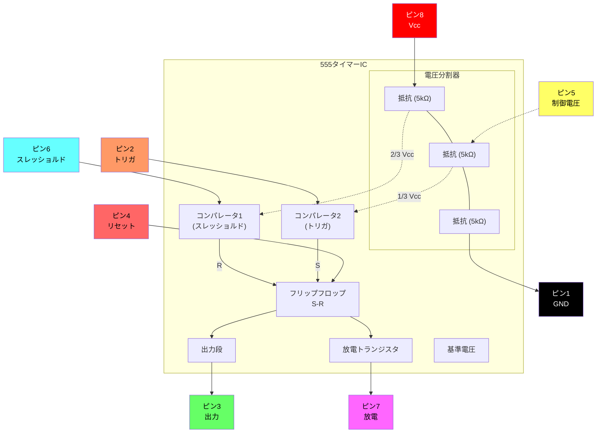

# 電子部品の接続

このガイドは、ブレッドボード上で電子回路を組み立てるためのステップバイステップの手順を提供します。各ビルドでは、新しい部品や概念が段階的に導入されます。

---

## 基本部品の組み立て手順

### ビルド1 — 単一LED

**部品:** 赤色LED、黒ジャンパーワイヤー、赤ジャンパーワイヤー、電池とホルダー

**手順:**

1. 黒ジャンパーワイヤーをブレッドボードの**A5**から**A14**に挿入します。
2. 赤ジャンパーワイヤーをブレッドボードの**J5**から**J14**に挿入します。
3. 赤色LEDを14行目に配置し、正極（2本の脚のうち長い方）を赤ワイヤーに合わせて右側に、負極を黒ワイヤーに合わせて左側に挿入します。
4. 電池をホルダーに入れ、ブレッドボードに配置して負極を黒に、正極を赤に接続します。

**結果:** 電池を挿入すると、LEDが点灯します。

**トラブルシューティング:**

- LEDが逆向きに挿入されていませんか？
- ジャンパーワイヤーはLEDの脚と同じ行にありますか？
- ジャンパーワイヤーは電池の端子と同じ行にありますか？

---

### ビルド2 — 単一プッシュボタン

**部品:** 赤色LED、プッシュボタン、黒ジャンパーワイヤー、赤ジャンパーワイヤー、電池とホルダー

**手順:**

1. 黒ジャンパーワイヤーをブレッドボードの**A5**から**A16**に挿入します。
2. 赤ジャンパーワイヤーをブレッドボードの**J5**から**J12**に挿入します。
3. 赤色LEDをブレッドボードに配置し、正極（長い脚）を**H15**に、負極を**G17**に挿入します。
4. プッシュボタンをブレッドボードの中央に横向きに配置し、左下のピンが16行目（黒ジャンパーワイヤーに合わせて）、右上のピンが14行目（赤LEDの負極に合わせて）に来るようにします。
5. 電池をホルダーに入れ、ブレッドボードに配置して負極を黒に、正極を赤に接続します。

**結果:** プッシュボタンを押すと、LEDが点灯します。

**トラブルシューティング:**

- LEDが逆向きに挿入されていませんか？
- ジャンパーワイヤーはLEDの脚と同じ行にありますか？
- ジャンパーワイヤーは電池の端子と同じ行にありますか？

---

### ビルド3 — フォトレジスタで調光するLED

**部品:** 緑色LED、フォトレジスタ、黒ジャンパーワイヤー、赤ジャンパーワイヤー、電池とホルダー

**手順:**

1. 黒ジャンパーワイヤーをブレッドボードの**A5**から**A12**に挿入します。
2. 赤ジャンパーワイヤーをブレッドボードの**J5**から**J13**に挿入します。
3. 緑色LEDをブレッドボードに配置し、正極（長い脚）を**F13**に、負極を**E13**に挿入します。
4. フォトレジスタをブレッドボードの**C12**から**D13**に挿入します。
5. 電池をホルダーに入れ、ブレッドボードに配置して負極を黒に、正極を赤に接続します。

**結果:** 電池を挿入するとLEDが点灯します。フォトレジスタを覆うとLEDが暗くなります。

---

### ビルド4 — ダブルLEDプッシュボタン

**部品:** 赤色LED、緑色LED、220Ω抵抗、プッシュボタン、黒ジャンパーワイヤー、赤ジャンパーワイヤー、電池とホルダー

**手順:**

1. 黒ジャンパーワイヤーをブレッドボードの**A5**から**A11**に挿入します。
2. 赤ジャンパーワイヤーをブレッドボードの**J5**から**J11**に挿入します。
3. 220Ω抵抗をブレッドボードの**I11**から**I15**に挿入します。
4. プッシュボタンをブレッドボードの中央に横向きに配置し、上のピンが15行目でブレッドボードの反対側に来るようにします。
5. 赤色LEDをブレッドボードに配置し、正極（長い脚）を**C17**に、負極を**B11**に挿入します。
6. 緑色LEDをブレッドボードに配置し、正極を**G15**に、負極を**E11**に挿入します。
7. 電池をホルダーに入れ、ブレッドボードに配置して負極を黒に、正極を赤に接続します。

**結果:** 電池を挿入すると緑色LEDが点灯します。プッシュボタンを押すと緑色LEDが消え、赤色LEDが点灯します。

### ビルド5 — フォトレジスタで点滅するLED

- 黒ジャンパーワイヤーをブレッドボードのA3からA12に挿入します。
- 赤ジャンパーワイヤーをブレッドボードのJ3からJ12に挿入します。
- 555集積回路チップをブレッドボードの中央に配置し、上のピンが12行目に来るようにします。
- ジャンパーワイヤーをブレッドボードのD15からG12に接続します。
- ジャンパーワイヤーをブレッドボードのD13からG14に接続します。
- 1000Ω抵抗をブレッドボードのC14からH17に挿入します。
- フォトレジスタをブレッドボードのB14からB15に挿入します。
- コンデンサをブレッドボードのA13からB12に挿入します。
- 緑色LEDをブレッドボードに配置し、正極（長い脚）をF17に、負極をC12に挿入します。
- 赤色LEDをブレッドボードに配置し、正極をI12に、負極をJ17に挿入します。
- 電池をホルダーに入れ、ブレッドボードに配置して負極を黒に、正極を赤に接続します。

電池を挿入すると、両方のLEDが高速で点滅し始めます。フォトレジスタを光から覆うと、LEDの点滅頻度が遅くなります。

---

## 555タイマーICリファレンス

555タイマーは、タイミング、パルス生成、発振器用途に使われる多用途の集積回路です。以下のセクションではピン配置情報と内部回路の詳細を提供します。

### 555ピン配置図

```
    ┌─────────────────────────────────────┐
    │  ●                                  │
    │  #1                             #8  │
    │  ┌──┐                         ┌──┐  │
    │  │  │                         │  │  │
    │  └──┘                         └──┘  │
    │  #2                             #7  │
    │  ┌──┐       555 TIMER         ┌──┐  │
    │  │  │                         │  │  │
    │  └──┘                         └──┘  │
    │  #3                             #6  │
    │  ┌──┐                         ┌──┐  │
    │  │  │                         │  │  │
    │  └──┘                         └──┘  │
    │  #4                             #5  │
    │  ┌──┐                         ┌──┐  │
    │  │  │                         │  │  │
    │  └──┘                         └──┘  │
    └─────────────────────────────────────┘
```

### 555ピン説明

| ピン | 記号 | 機能 |
|:---:|:---:|:---|
| 1 | GND | グランド基準（0V） |
| 2 | TRIG | トリガ入力 — 電圧が⅓ Vcc以下になるとタイミングサイクルを開始 |
| 3 | OUT | 出力 — 高または低の信号を提供 |
| 4 | RESET | リセット入力（アクティブロー） — グランドに接続すると出力を低に強制 |
| 5 | CONT | 制御電圧 — 内部電圧分割器（⅔ Vcc）へのアクセスを提供 |
| 6 | THRES | スレッショルド入力 — 電圧が⅔ Vccを超えるとタイミングサイクル終了 |
| 7 | DISCH | 放電 — タイミングコンデンサの放電用オープンコレクタ出力 |
| 8 | Vcc | 電源電圧（+4.5V〜+16V） |

### 555内部ブロック図



---

### ビルド6 — プッシュボタンブザー

**部品:** 555タイマーIC、圧電スピーカー、220Ω抵抗、1000Ω抵抗、コンデンサ、プッシュボタン、ジャンパーワイヤー、電池とホルダー

**手順:**

1. 黒ジャンパーワイヤーをブレッドボードの**A1**から**A11**に挿入します。
2. 赤ジャンパーワイヤーをブレッドボードの**J1**から**J11**に挿入します。
3. 555集積回路チップをブレッドボードの中央に配置し、上のピンが11行目に来るようにします。
4. ジャンパーワイヤーをブレッドボードの**D12**から**G13**に接続します。
5. ジャンパーワイヤーをブレッドボードの**D14**から**G11**に接続します。
6. コンデンサをブレッドボードの**A12**から**B11**に挿入します。
7. 220Ω抵抗をブレッドボードの**C12**から**C13**に挿入します。
8. プッシュボタンをブレッドボードの中央に横向きに配置し、上のピンが15行目でブレッドボードの反対側に来るようにします。
9. 圧電スピーカーをブレッドボードに挿入し、正極ピンを**A9**、負極ピンを**A6**に挿入します。
10. 1000Ω抵抗をブレッドボードの**E6**から**A13**に挿入します。
11. ジャンパーワイヤーをブレッドボードの**C9**から**D15**に接続します。
12. ジャンパーワイヤーをブレッドボードの**G17**から**I11**に接続します。
13. 電池をホルダーに入れ、ブレッドボードに配置して負極を黒に、正極を赤に接続します。

**結果:** プッシュボタンを押すと、ブザーが鳴ります。

---

### ビルド7 — フォトレジスタテルミン

**部品:** 555タイマーIC、圧電スピーカー、フォトレジスタ、1000Ω抵抗、コンデンサ、プッシュボタン、ジャンパーワイヤー、電池とホルダー

**手順:**

1. 黒ジャンパーワイヤーをブレッドボードの**A1**から**A11**に挿入します。
2. 赤ジャンパーワイヤーをブレッドボードの**J1**から**J11**に挿入します。
3. 555集積回路チップをブレッドボードの中央に配置し、上のピンが11行目に来るようにします。
4. ジャンパーワイヤーをブレッドボードの**D12**から**G13**に接続します。
5. ジャンパーワイヤーをブレッドボードの**D14**から**G11**に接続します。
6. コンデンサをブレッドボードの**A12**から**B11**に挿入します。
7. フォトレジスタをブレッドボードの**C12**から**C13**に挿入します。
8. プッシュボタンをブレッドボードの中央に横向きに配置し、上のピンが15行目でブレッドボードの反対側に来るようにします。
9. 圧電スピーカーをブレッドボードに挿入し、正極ピンを**A9**、負極ピンを**A6**に挿入します。
10. 1000Ω抵抗をブレッドボードの**E6**から**A13**に挿入します。
11. ジャンパーワイヤーをブレッドボードの**C9**から**D15**に接続します。
12. ジャンパーワイヤーをブレッドボードの**G17**から**I11**に接続します。
13. 電池をホルダーに入れ、ブレッドボードに配置して負極を黒に、正極を赤に接続します。

**結果:** プッシュボタンを押すとブザーが鳴ります。フォトレジスタを覆うとブザーの音程が変わります。

---

### ビルド8 — ポテンショメータで調光するLED

**部品:** 緑色LED、ポテンショメータ、220Ω抵抗、黒ジャンパーワイヤー、赤ジャンパーワイヤー、電池とホルダー

**手順:**

1. 黒ジャンパーワイヤーをブレッドボードの**A1**から**A13**に挿入します。
2. 赤ジャンパーワイヤーをブレッドボードの**J1**から**J9**に挿入します。
3. ポテンショメータを配置し、2ピン側を左にして、上のピンを**E13**、下のピンを**E15**に挿入します。
4. 220Ω抵抗をブレッドボードの**H9**から**H14**に挿入します。
5. 緑色LEDをブレッドボードに配置し、正極（長い脚）を**C15**に、負極を**B13**に挿入します。
6. 電池をホルダーに入れ、ブレッドボードに配置して負極を黒に、正極を赤に接続します。

**結果:** 電池を挿入するとLEDが点灯します。ポテンショメータを回すとLEDの明るさが増減します。

---

### ビルド9 — プッシュボタンRGB LED

**部品:** RGB LED（共通カソード）、3つのプッシュボタン、220Ω抵抗2個、黒ジャンパーワイヤー、赤ジャンパーワイヤー、ジャンパーワイヤー、電池とホルダー

**手順:**

1. 黒ジャンパーワイヤーをブレッドボードの**A1**から**B7**に挿入します。
2. 赤ジャンパーワイヤーをブレッドボードの**J1**から**J7**に挿入します。
3. RGB LEDをブレッドボードの**A4**から**A8**に挿入します。4本の脚のうち最も長い脚がグランドで、**A7**に挿入します。
4. 3つのプッシュボタンをブレッドボードの中央に横向きに配置し、ピンは以下の位置にします:
   - ボタン1: **E9–F9** と **E11–F11**
   - ボタン2: **E12–F12** と **E14–F14**
   - ボタン3: **E15–F15** と **E17–F17**
5. ジャンパーワイヤーをブレッドボードの**C5**から**D9**に接続します。
6. ジャンパーワイヤーをブレッドボードの**C6**から**C12**に接続します。
7. ジャンパーワイヤーをブレッドボードの**B8**から**B15**に接続します。
8. 1つ目の220Ω抵抗をブレッドボードの**G7**から**G11**に挿入します。
9. 2つ目の220Ω抵抗をブレッドボードの**H7**から**H14**に挿入します。
10. 電池をホルダーに入れ、ブレッドボードに配置して負極を黒に、正極を赤に接続します。

**結果:** 各プッシュボタンを押すと、RGB LEDの異なる色チャンネルが点灯します。

---

### ビルド10 — ポテンショメータ制御ブザー

**部品:** 555タイマーIC、圧電スピーカー、ポテンショメータ、220Ω抵抗、コンデンサ、プッシュボタン、ジャンパーワイヤー、電池とホルダー

**手順:**

1. 黒ジャンパーワイヤーをブレッドボードの**A1**から**A11**に挿入します。
2. 赤ジャンパーワイヤーをブレッドボードの**J1**から**J11**に挿入します。
3. 555集積回路チップをブレッドボードの中央に配置し、上のピンが11行目に来るようにします。
4. ジャンパーワイヤーをブレッドボードの**D12**から**G13**に接続します。
5. ジャンパーワイヤーをブレッドボードの**D14**から**G11**に接続します。
6. コンデンサをブレッドボードの**A12**から**B11**に挿入します。
7. 圧電スピーカーをブレッドボードの**A6**から**A9**に挿入します（正極を下側に配置）。
8. プッシュボタンをブレッドボードの中央に横向きに配置し、上のピンを**E15**と**F15**にします。
9. 220Ω抵抗をブレッドボードの**E6**から**A13**に挿入します。
10. ジャンパーワイヤーをブレッドボードの**E9**から**D15**に接続します。
11. ジャンパーワイヤーをブレッドボードの**G17**から**I11**に接続します。
12. ポテンショメータを配置し、2ピン側を右にして、上のピンを**F7**、下のピンを**F9**に挿入します。
13. ジャンパーワイヤーをブレッドボードの**D8**から**B13**に接続します。
14. ジャンパーワイヤーをブレッドボードの**H7**から**C12**に接続します。
15. ジャンパーワイヤーをブレッドボードの**H9**から**D11**に接続します。
16. 電池をホルダーに入れ、ブレッドボードに配置して負極を黒に、正極を赤に接続します。

**結果:** プッシュボタンを押すとブザーが鳴ります。ポテンショメータを回すとブザーの音程が変わります。
