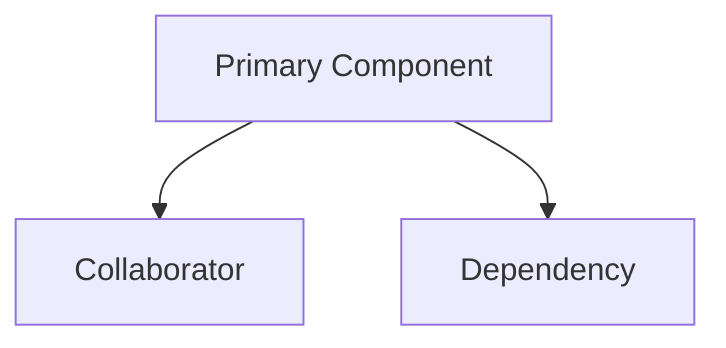

# [Component Name] ドキュメント

[コンポーネントの目的とシステム内での役割を簡潔に説明します。]

## 1. コンポーネント概要

### 目的／責任

- OVR-001: コンポーネントの主な責任を明記する
- OVR-002: 範囲を定義し、含まれる責任と除外される責任を示す
- OVR-003: システムコンテキストと主要な関係を説明する

## 2. アーキテクチャセクション

- ARC-001: 使用されている設計パターンを文書化する
- ARC-002: 内部および外部の依存関係とその目的を一覧にする
- ARC-003: コンポーネント間の相互作用と関係を説明する
- ARC-004: 構造や動作を明確にする視覚的な図を含める
- ARC-005: 構造、関係、依存関係を示すMermaid図を提供する

### コンポーネント構造と依存関係の図

現在の以下を示す：

- コンポーネント構造
- 内部依存関係
- 外部依存関係
- データフロー
- 継承およびコンポジションの関係



## 3. インターフェースドキュメント

- INT-001: 公開インターフェースと使用パターンを文書化する
- INT-002: メソッドまたはプロパティのリファレンステーブルを提供する
- INT-003: イベント、コールバック、通知機構があれば説明する

| メソッド／プロパティ | 目的 | パラメータ | 戻り値の型 | 使用上の注意 |
|---------------------|-------|------------|-------------|-------------|
| [Name] | [Purpose] | [Parameters] | [Type] | [Notes] |

## 4. 実装の詳細

- IMP-001: 主な実装クラスと責任を説明する
- IMP-002: 設定要件と初期化パターンを記録する
- IMP-003: 主要なアルゴリズムやビジネスロジックを要約する
- IMP-004: パフォーマンス特性とボトルネックを記述する

## 5. 使用例

### 基本的な使用法

```text
[コンポーネントの言語とAPIに沿った基本的な使用例]
```

### 高度な使用法

```text
[現在の実装に沿った高度な設定やオーケストレーションの例]
```

- USE-001: 基本的な使用例を提供する
- USE-002: 高度な設定パターンを示す
- USE-003: ベストプラクティスと推奨パターンを文書化する

## 6. 品質属性

- QUA-001: セキュリティ
- QUA-002: パフォーマンス
- QUA-003: 信頼性
- QUA-004: 保守性
- QUA-005: 拡張性

## 7. 参考情報

- REF-001: バージョンと目的が分かる依存関係を一覧にする
- REF-002: 設定オプションを文書化する
- REF-003: テストガイダンスとモック設定のメモを提供する
- REF-004: トラブルシューティングのメモとよくある問題を記録する
- REF-005: 関連ドキュメントへのリンクを追加する
- REF-006: 変更履歴や移行メモを必要に応じて追加する
